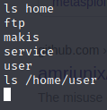

# Lame

We're starting with Lame, first of the retired machines.  It's not rated particularly difficult, so this shouldn't take particularly long.


With the machine started, let's get this going.

Let's make sure that VPN is functioning properly and that we can see the test machine.


All looks good there, so let's start with a port scan using ```nmap```.

As we're not concerned about any alerting or anything of that nature, we're going to run max speed, hit every port, and let's fingerprint all the things.


Hmm, we were able to ```ping``` it a moment ago, well, let's try a ```-Pn``` to see what response we get.

Oh ho!  These findings look promising:


Our most likely targets will be a possible vulnerability of vsFTPd or, more likely, SMB running on the box.  (Who doesn't love  SMB?)  Let's run a google search for exploits for either and see what we find.

Looking at our Google results for vsFTPd, it would seem there is a potential backdoor, and we have choices of using metasploit or we can get exploit examples off of GitHub.  Being that you can only use metasploit/meterpreter on one machine in the OSCP, let's not make that a habit.

Let's try the first GitHub result that came back: https://github.com/ahervias77/vsftpd-2.3.4-exploit

We'll browse to ```/opt``` and create a folder for vsFTPd, then let's clone that project.


Okay, let's run this exploit and see where we end up.


So, at this point, it seems that either a.) the backdoor has been fixed, or b.) the version is exploitable, which should spawn a shell on port ```6200```, however, being that we cannot connect to the shell on ```6200```, could be a local firewall blocking that port.  Either way, no luck there.  On to SMB!

Let's run a Google search for 3.0.20-Debian exploits, and again, we'll look for GitHub.  Let's grab the first search result that came back: https://github.com/macha97/exploit-smb-3.0.20.git

We'll browse to ```/opt``` and create a folder for SMB, then let's clone that project.


Being that the GitHub page does not include any syntax for how to run the command, let's check the file contents to see how it works.  You can use ```gedit```, ```nano```, etc., but I prefer ```vi```.


Being that the target is 10.10.10.3, it would seem this script was created specifically for this challenge.  Since the payload is all hex code, let's take it, remove all the extra fluff and get just the hex values.


Now that we have the hex, let's convert it over to ASCII to see what's going on here.


Ah, it would appear that they hardcode the listener IP in the payload.  So we'll need to change that to our IP, and then convert it back to hex.


There we go, the hex is now fixed to our IP.  Now let's convert it back to code for the payload.


That looks better, now let's edit the python file to reflect our changes.


Since the payload is configured to connect back to us, we need to configure a listener on our system, which can be achieved with ```netcat```.


Now that our listener is configured, let's launch the payload.


An error?!  No, a learning moment!  We're missing SMB for python, let's install it.


Now that we have pysmb installed, let's try launching the exploit again.


Good news, our edit didn't cause any errors.  Now let's check our listener to see if it worked.


Fantastic!  We're now connected to the machine as root.  Let's go get those flags.



Nope, not in the user directory, most be under another account.


That's one flag, now for the other!


And there we have it.  Both flags.

___

[Back](../)
