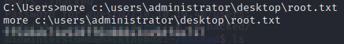

# Blue

We're working on the machine "Blue" on Hack the Box.


Let's start with running ```nmap``` against the box.


Being that SMB is open and this machine is called "Blue," one can assume that it's probably vulnerable to Eternal Blue.

Let's go out to Google to find an Eternal Blue exploit on GitHub.  In this case we're going to use https://github.com/worawit/MS17-010.

Now, let's clone a copy of it to our ```/opt``` directory (I'm storing it under a folder for SMB attacks, but, sort how you see fit, go wild).


Let's run the checker against the target to see if it's vulnerable to Eternal Blue.


Like we figured, it is.

Next we're going to need to take the Eternal Blue assembly shellcode and output it as a bin file.


We'll then use msfvenom to create a Windows reverse shell (being that it's Windows 7, there's a decent likelihood that it's a 64-bit install, though always keep that in mind).

We're going to want to output is a raw bin file also.


Now that we have both bin files we can merge the ```kernel.bin``` and ```shell.bin``` files into a single ```exploit.bin``` file by using ```cat``` to append ```shell.bin``` to the end of ```kernel.bin```.


Now that we have our exploit all ready to go, let's start up a ```netcat``` listener.


With the listener keeping a digital ear out, let's kick off the exploit.


All looks to have completed, let's check the status of our listener.


We'll now check the ```C:\Users``` directory to see where each flag will live.


Let's grab the user flag.


And lastly, the root flag.



Another box down, and we're moving on.