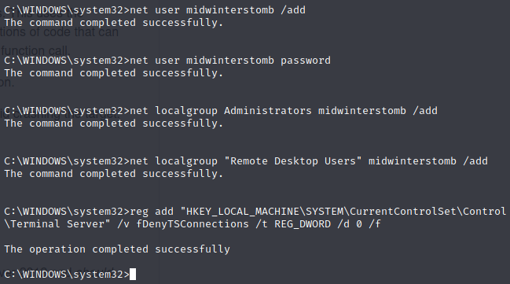

# Legacy

Let's take a crack at the Hack the Box machine, Legacy.


Let's ```ping``` the machine to make sure we can see it.


Now that we're sure it's up, let's run ```nmap``` against the machine.


It's a Windows XP machine with SMB open, so it's likely vulnerable to Eternal Blue.

Let's run a ```nmap``` scan against it specifically to check if it's vulnerable.


Well, that settles it.  It's vulnerable.  Let's grab an Eternal Blue exploit with a quick Google search.

In this case we're going to use https://github.com/3ndG4me/AutoBlue-MS17-010.

Let's clone the repository into our ```/opt``` directory.


We'll run the check against the target to verify that the exploit sees the same.


With that confirmed, we'll kick off the exploit.


We're feeling saucy, let's play with this box.  Let's add a new user account, set the password, add it to the ```Administrators``` and ```Remote Desktop Users``` group, and then enable RDP via the registry.



Now let's RDP into the computer.


We'll now grab the user flag.


And the root.


Onward to the next machine.

___

[Back](../)
