# Jerry

Hi there, Jerry, are you ready?

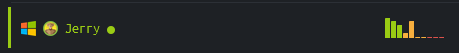

Let's go ```nmap```!

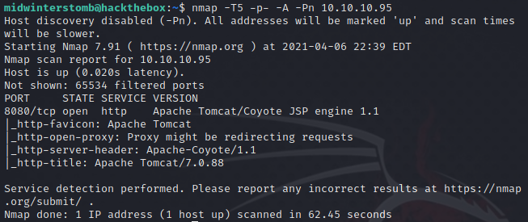

It seems we have a website running on port ```8080```.  Let's take a look.

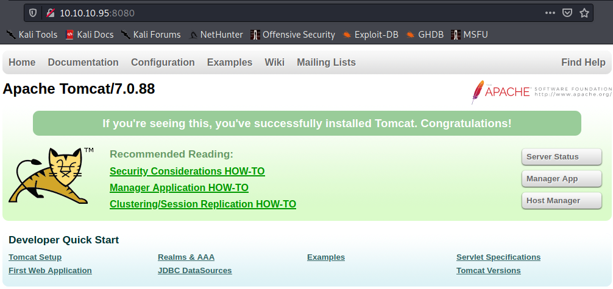

Looks like an Apache Tomcat administration page.

Let's click on Manager App.

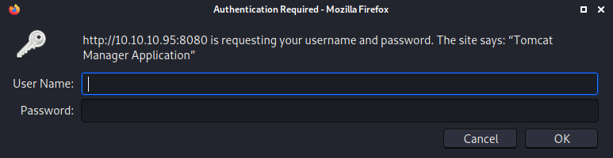

We get prompted for credentials we don't have, so let's hit cancel.

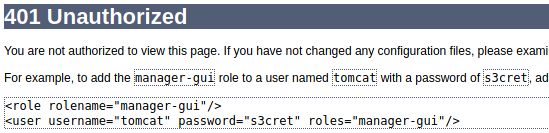

The 401 Unauthorized page gives us the username and password if configuration hasn't be changed.  So let's refresh and try it again.

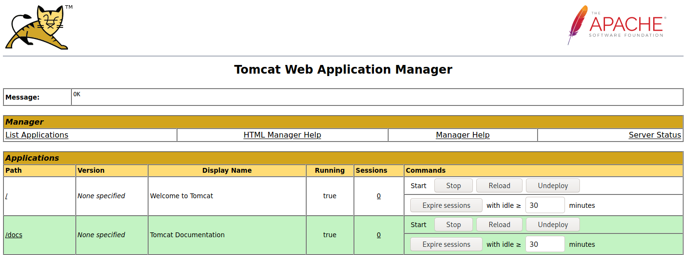

Looks like that was successful.

We also have a section to deploy a ```.WAR``` file from our own machine.

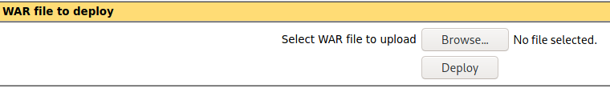

Let's use ```msfvenom``` to generate a Java reverse shell as a ```.WAR``` file.

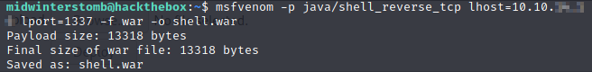

We'll then click on "Browse..." and select the file we created.

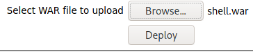

Now let's set up a ```netcat``` listener.

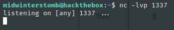

Once that's done, we'll deploy our ```.WAR``` file, which now shows up as an application in the list.

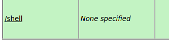

Let's check out our listener to see if it worked, as well as to see who are.

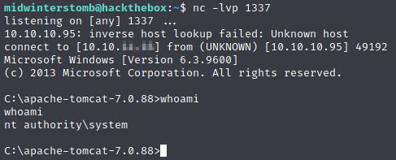

Looks like we're the system account.  Let's go pick up the flags.

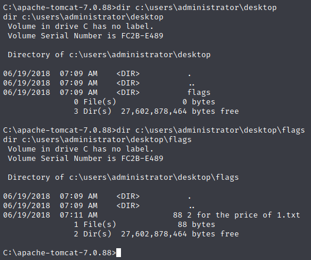

If we look in the usual location, it seems we have a directory called ```flags``` which contains a file called ```2 for the price of 1.txt```.

Let's take a look in that file and see if it contains both flags.

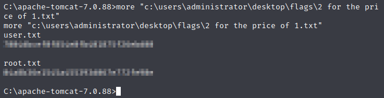

Looks like that's the case, and this box is done.