# Nibbles

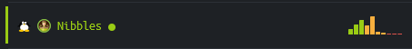

```nmap``` powers, activate!  Form of... port scan!

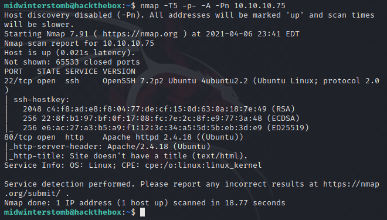

Looks like we have SSH and HTTP responding.  It's unlikely we'll be exploiting SSH, so let's look at what's on port ```80```.

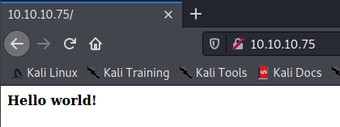

Looks like we have a Hello world! page, and not much else.  Let's see if there's anything in the source code.

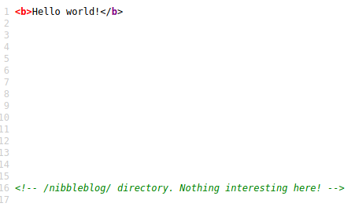

The source references a directory of ```/nibbleblog/```.  So, let's see what's there.

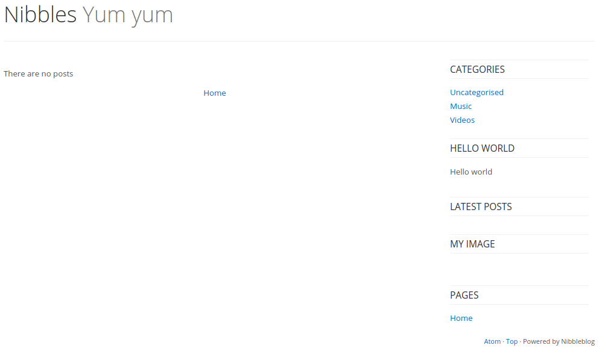

Looks like there's a blog with not a lot there.  If we do some Googling of nibbleblog, we find that it's a blogging software that has an admin page at ```/admin.php```.  Let's take a look at that.

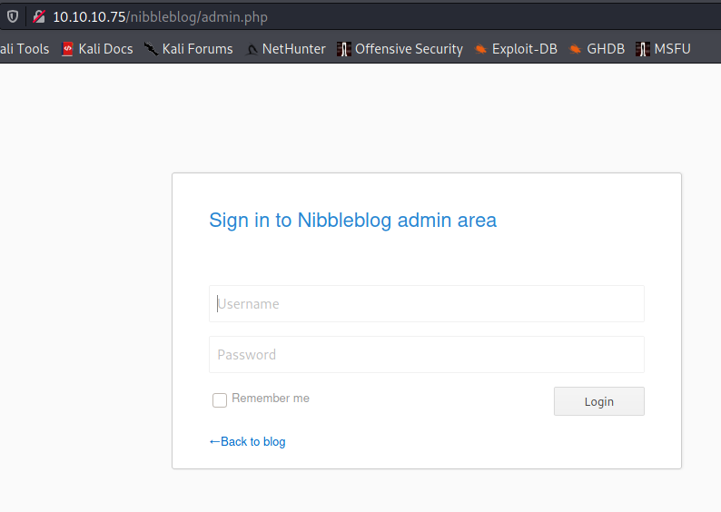

Let's run ```hydra``` against the admin page to see if it can get a login while we look on the internet to see if nibbleblog has a default login.

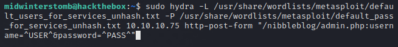

Well, it turns out the machine blocks you after too many attempts, so we're going to have to wait a few for the block to end.

Since automated password guessing is out, let's try something simple and obvious like a username of "admin" and a password of "nibbles".

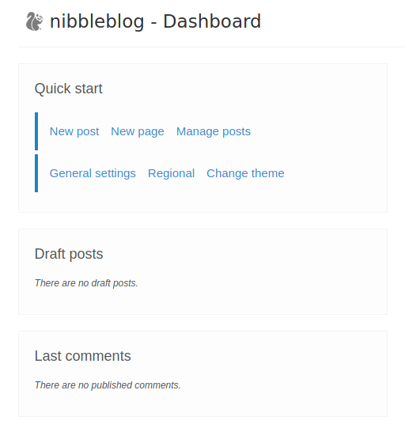

Well that's just sad, but we have access to the admin dashboard.

Looks like there's also an option there to manage plugins.

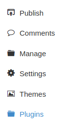

Now, if we go into the Plugins settings we see there's one called "My image" that we can configure.

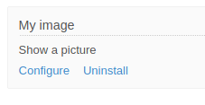

Let's grab a php webshell (here we're using https://github.com/artyuum/Simple-PHP-Web-Shell), and rename it to ```shell.php```.

Now we'll edit the "My image" plugin, renaming it to "shell" with a caption of "shell" and upload our ```shell.php``` file, then we'll save the changes.

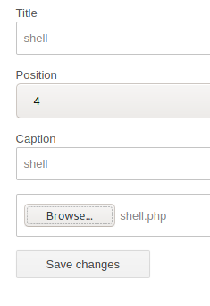

Now that the webshell is loaded, let's browse to the plugin at http://10.10.10.75/nibbleblog/content/private/plugins/my_image/image.php.

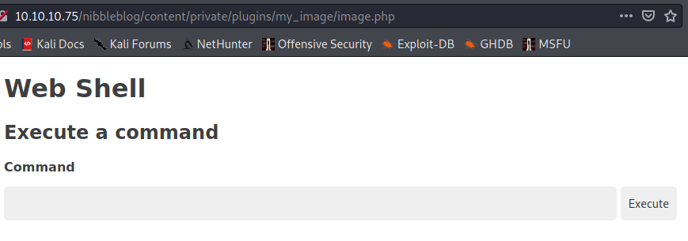

Looks good, let's find who we are.

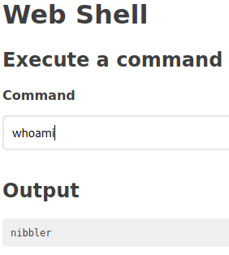

Looks like we're currently running as an account named "nibbler".

Let's use our access to get the user flag.

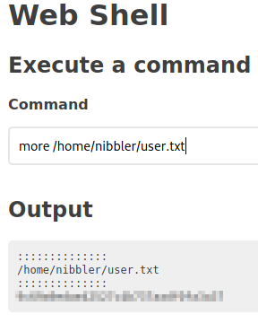

Let's run ```sudo -l``` to see if there's anything we can run with elevated rights.

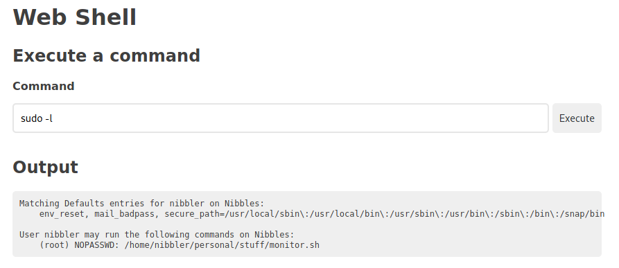

Looks like we can run a file called ```monitor.sh``` if we run it from ```/home/nibbler/personal/stuff/monitor.sh```.

If we poke around, we find that there's a ```.zip``` file called ```personal.zip``` located in ```/home/nibbler/```.

Let's unzip the file.

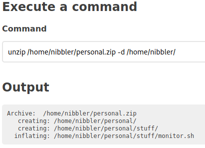

Now let's use ```echo``` to store the command ```cat /root/root.txt``` into ```/home/nibbler/personal/stuff/monitor.sh```

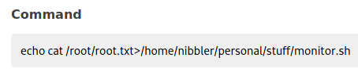

Now that we've modified ```monitor.sh``` we can call it with ```sudo``` and the full path, and it will return the root flag.

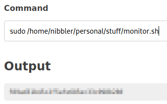

And there we are, another box completed.

___

[Back](../)
