# Optimum


```nmap``` go brrr.

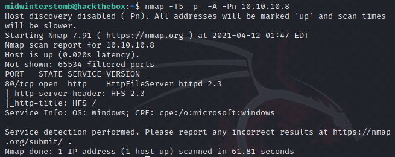

Looks like the only port we have open is ```80``` which is running HttpFileServer httpd 2.3.

Let's take a look at the web interface.

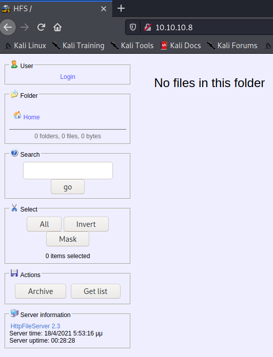

Looks like a pretty simple page, so let's search for a httpfileserver 2.3 exploit.  We're going to use [https://www.exploit-db.com/exploits/39161](https://www.exploit-db.com/exploits/39161).

We'll have to edit the python file to add in our IP and port for our listener.

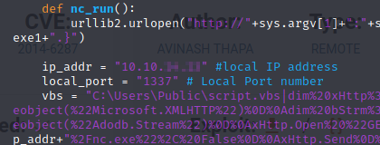

Once we have that saved, we will need to start our listener.

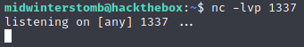

Now let's run ```hfsexploit.py``` against the target machine.

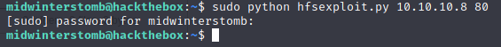

Let's check our listener to see if we got a connection.

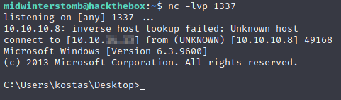

Looks good, let's run ```systeminfo``` to learn a bit more about this box.

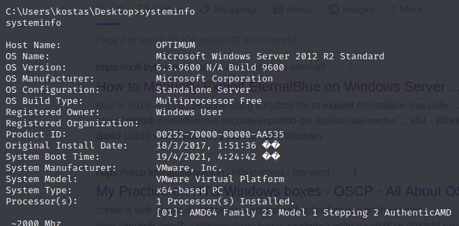

Let's run a search for exploits on GitHub for Server 2012 R2 6.3 Build 9600.

We see that MS16-032 comes back, however, it is not exploitable due to having only one CPU.

If we look a bit further, we find that it should also be vulnerable to MS16-098.  We'll download [https://github.com/SecWiki/windows-kernel-exploits/tree/master/MS16-098](https://github.com/SecWiki/windows-kernel-exploits/tree/master/MS16-098) for our purposes.

We are going to serve up ```bfill.exe``` using a python HTTP server.

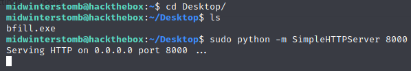

Let's check in a browser to verify it's working.

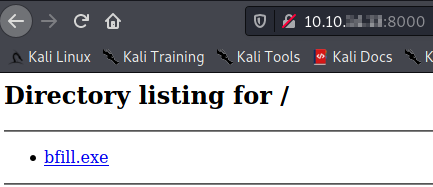

Now let's download ```bfill.exe``` to the server using ```certutil```.

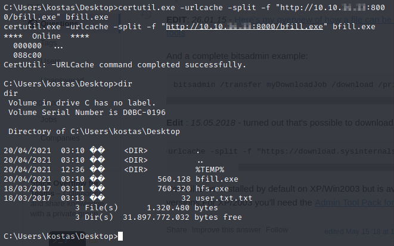

Before we run the exploit, let's go grab the user flag.

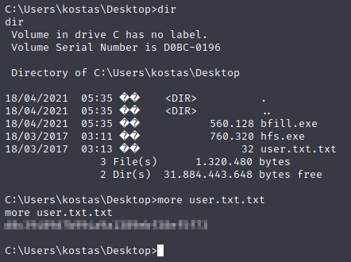

Now that the file is downloaded, and we have the user flag, let's run the exploit.

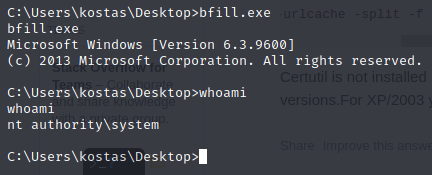

Looks like it was successful.  Now we'll go pick up the root flag.

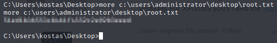

Catch you in the next box.

___

Findings

___

**Operating System:** Windows Server 2012 R2 Standard

**IP Address:** 10.10.10.8

**Open Ports:**
- 80

**Services Responding:**
- HTTP

**Vulnerabilities Exploited:**
- CVE-2014-6287
- MS16-098

**Configuration Insecurities:**
- None detected in process of exploitation

**General Findings:**
- Consider updating HttpFileServer to HFS3 v0.43.0
- Consider installing all missing operating system patches to reduce attack surface

___

[Back](../)
