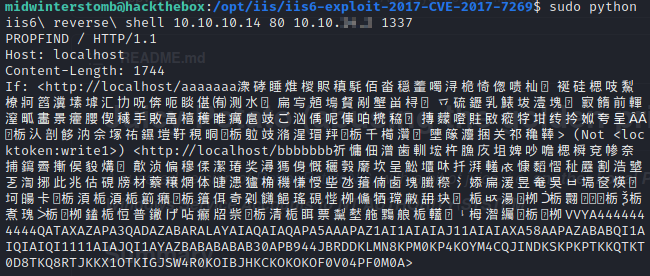
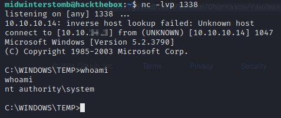

# Grandpa


Let's kick off ```nmap``` as you'd expect.


Looks like we have port ```80``` open, serving up IIS 6.0.

Let's run a search for "IIS 6.0 exploit github" on Google.  We're going to use https://github.com/g0rx/iis6-exploit-2017-CVE-2017-7269.

Let's clone the github repo to our ```/opt``` directory.


Now that we have that on our system, let's kick off a ```netcat``` listener.


Now that the listener is running, let's kick off the exploit.



Let's check out our listener to verify it worked.


Let's run ```systeminfo``` to gain some information about the system.


Looks like we're running Windows Server 2003.

Now let's check what privileges our current account has.


Now that we know it's Server 2003 and we have the "seimpersonateprivilege" enabled, we can search for "seimpersonateprivilege exploit server 2003".

We find http://nomoreroot.blogspot.com/2008/10/windows-2003-poc-exploit-for-token.html, however the link to the file is broken.

Though, we can use that info to instead run a search for "download churrasco.exe", which leads us to https://github.com/Re4son/Churrasco.

We'll download the file directly from https://github.com/Re4son/Churrasco/raw/master/churrasco.exe.

Next, we need to get copy of ```nc.exe```.  If you're running Kali, you can grab it from your drive, or you can download a copy from https://eternallybored.org/misc/netcat/.

Now that we have both files, let's share both in a SMB share with Impacket.


Now on the server we're going to map our SMB share as a network drive by utilizing ```net use```.


Once we have the drive mapped, we'll create a ```temp``` directory in the root of ```C:\```.


We're now going to copy both files from our network share to the temp directory we just created.


Now let's free up that network share.


Now let's setup a listener to call back to.


We'll now create a Windows batch file by using ```echo``` to output our command into a file called ```exploit.bat```.


Now that we have the batch file created, let's launch it with ```churrasco.exe```.


Let's check out our listener and verify we're now the system account.



Looks good, now let's grab the user and root flags.

