# Academy

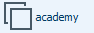

Let's ```nmap``` this VM and get started.

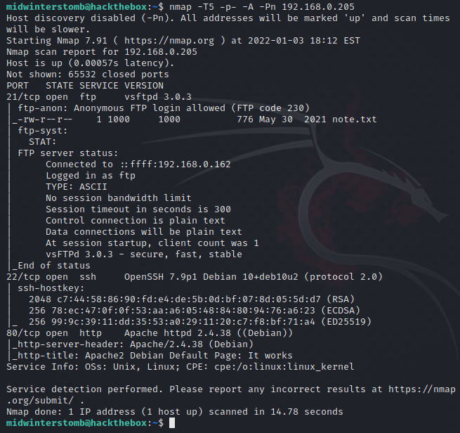

Looks like we have FTP, SSH, and HTTP responding.  Let's start with looking at the FTP share.

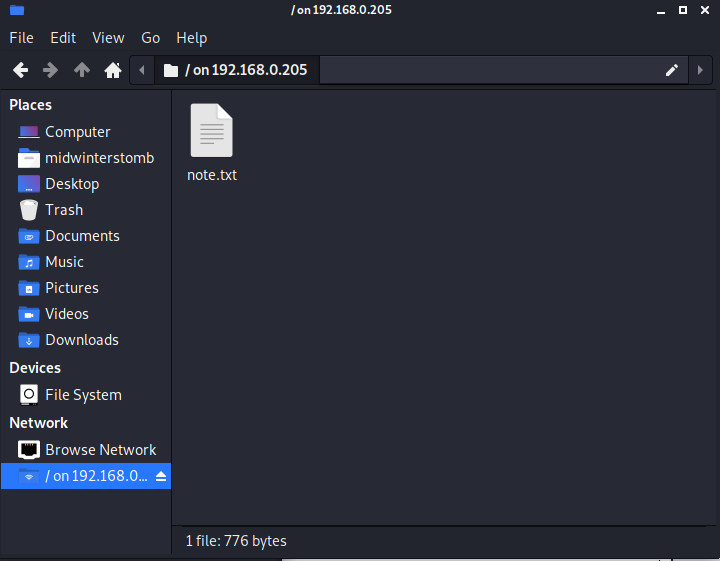

Looks like the FTP share has a single text file inside.  Let's see what it says.

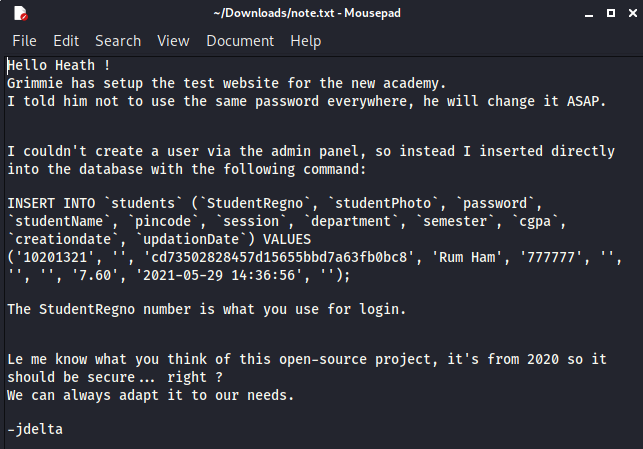

Looks like it has some details regarding user creation and login information.

Let's check out the web page to see if we can utilize the credentials there.

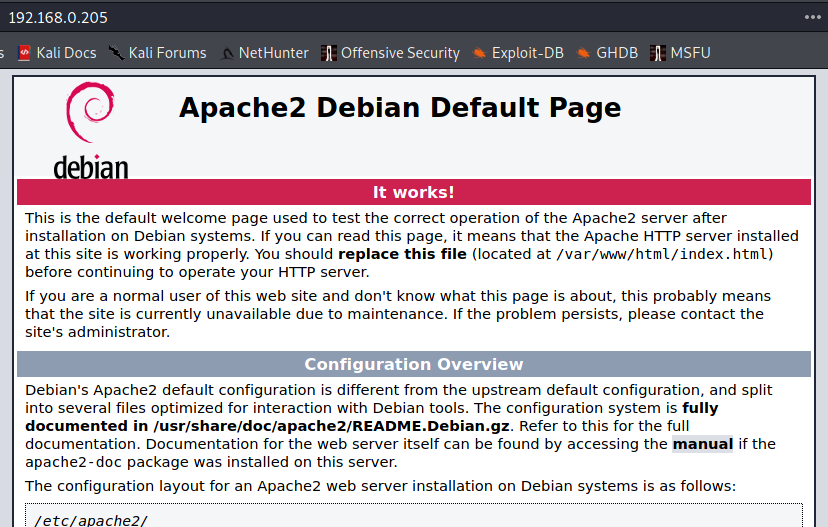

Since it's just a place holder, let's see if can guess the web application address, based on the name of the machine.

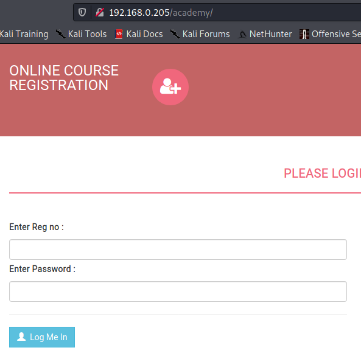

Now let's try those credentials from the text file.

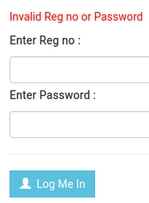

It's probably safe to guess then that the password is a MD5 hash.  Let's see if we can crack the hash and use that as the password.

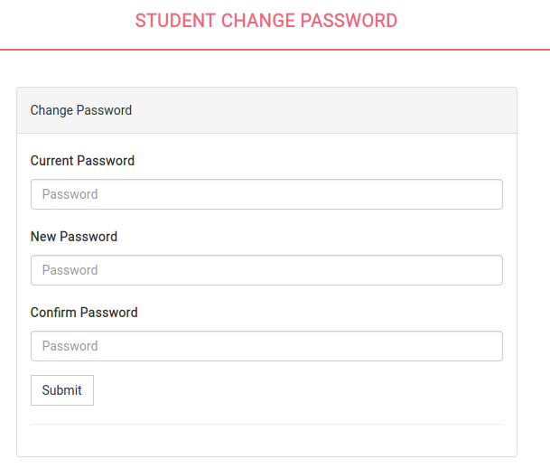

That worked.  Took us right to a change password menu after putting in the cracked password.  Now let's browse to "My Profile."

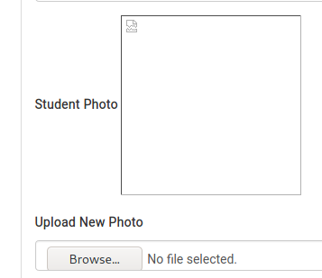

We have no photo, but can upload a file.  Let's try to upload a PHP web shell as the photo.  I will be using White Winter Wolf's PHP webshell (https://github.com/WhiteWinterWolf/wwwolf-php-webshell).

That looks like it took.  Now let's view the properties of the "image" to see where it's located on the webserver, so we can go use that shell.

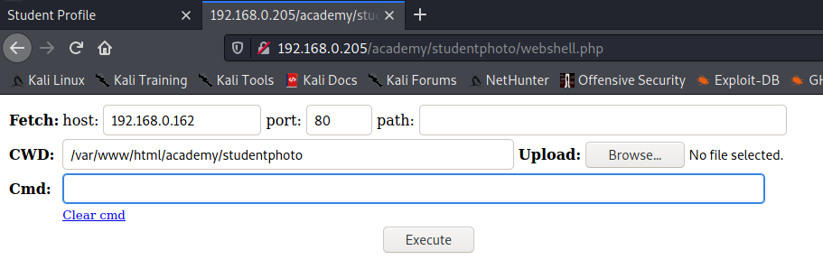

Looks like the webshell is loading, let's give it a  whirl.

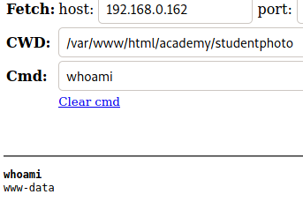

Now to find some vulnerabilities on the server.  Let's download LINPEAS from https://github.com/carlospolop/PEASS-ng/releases/latest/download/linpeas.sh and then upload it to the server.

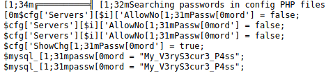

After running it, we find a potential password stored in PHP config files.  It's flagged as being for mysql.

Let's see if we can use that to switch user to a mysql service account.

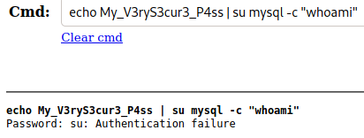

Doesn't look like it's for the mysql account, so let's try "grimmie", since as we saw in the note earlier, they built the server.

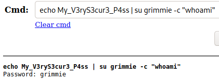

Looks to have authenticated and run our ```whoami``` command.  Let's see if we can swap to SSH so that we can stop using the webshell.

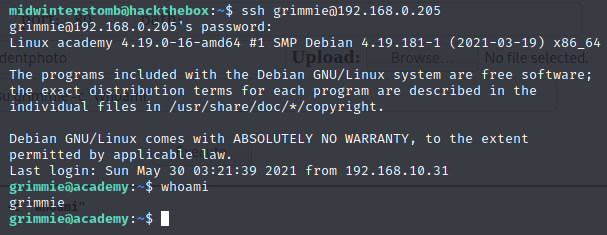

That looks like it worked.  Now to see if we can escalate to root.

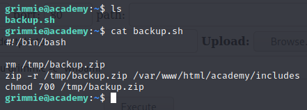

It looks like grimmie has a backup script in their home directory, that dumps out a zipped up copy of files into ```/tmp```.  Let's see what properties that file has.

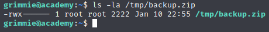

It looks like the file ends up with root permissions when it is created.  Let's try adding a reverse shell to the script and see if root calls back to us.

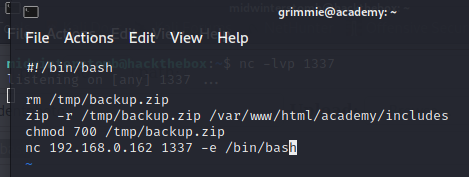

We wait for a few since we don't know what the script interval is.

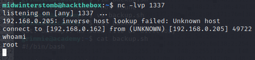

Success, we are now root.

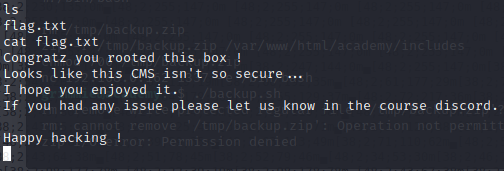


