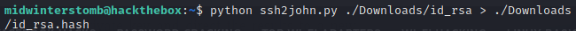
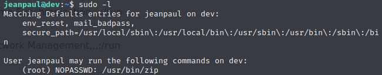

# Dev


A quick ```nmap``` and see what we're up against.


We see that NFS is running and exposed, let's see if we can mount the server via NFS.


Let's take a look inside this zip file and see if there's anything interesting inside.


Looks like there's a todo list and a RSA key in there, however they're password protected.  Shall we see what we can do about that?

Let's use John The Ripper to extract the hashes from the zip file so that we can crack them.

We'll start with ```zip2john``` to get the hash.


Now we'll use ```john``` to crack the hash we acquired.


Now that we know the password is java101, let's explore those file contents.


Well, the todo file didn't have a whole lot, but still worth noting in case jp is a username, we likely will run across java, etc.

Let's download a copy of ```ssh2john``` to crack the private key password.


Now let's get the hash.



Let's let John take a crack at the hash using the ```rockyou.txt``` list.


While that runs, we can take a look at other things on the system.  Let's start with the webpage running on ```80```.


We see that the page gives a configuration error page.

Being that Bolt is saying it's in the wrong directory, let's try browsing to the ```/public/``` directory.


It looks like it redirects down through a few sub-directories ultimately resulting in an error page.  Let's see what happens if we specify the index page of public.


Looks like it redirected into Bolt and took us to a user creation page.  Let's try creating a user.


Looks like creating a user worked successfully.


If we look under settings, there's a "File Management" section.

Let's browse into File Management and see if we can upload a remote shell.


It has restricted file extensions, not allowing php, nor if we upload a renamed webshell can we change the extension to php.

While we ruminate on that, let's run dirbuster against port ```80``` and port ```8080```.


We find a ```config.yml``` file if we go into the ```config``` sub directory of the ```app``` directory on port ```80```.


Inside of the config file we find a username and password.  We'll take note of those for potential use later.

Let's move on to ```8080```.


On port ```8080``` we have a directory of ```dev```, browsing to that we find a site running called BoltWire.

Let's click register and create an account to poke around with.

If we run a search for BoltWire vulnerabilities, we find that it has a vulnerability allowing directory traversal to read ```/etc/passwd```: [https://www.exploit-db.com/exploits/48411](https://www.exploit-db.com/exploits/48411)

Let's execute that request.


We see a list of users, of special notice is our aforementioned JP.


Now let's try to combine this user, the ```id_rsa``` key we found previously, and the password in the configuration file to access JP's account.


If we run ```sudo -l``` we can see what ```sudo``` rights JP has.



Being that we have ```sudo``` access to the ```zip``` command, we'll create a file to tell ```zip``` to zip, and escalate via ```zip```.

Let's use ```touch``` to create the file to tell the system to zip, and then run our ```zip``` command.


Now let's grab the flag.


And with that, we've finished another box.

___

Findings

___

**Operating System:** Debian 10

**IP Address:** 192.168.0.176

**Open Ports:**
- 22
- 80
- 111
- 2049
- 8080
- 35875
- 36163
- 57759
- 59699

**Services Responding:**
- SSH
- HTTP
- RPC
- NFS

**Vulnerabilities Exploited:**
- Anonymous NFS access
- Weak password scheme
- Configuration file exposed with no authentication
- Local file inclusion

**Configuration Insecurities:**
- NFS share allowing anonymous access
- Configuration file including credentials exposed

**General Findings:**
- Consider placing NFS share behind authentication
- Consider strengthening authentication if SSH keys are to be stored in a share
- Consider upgrading BoltWire to version 7.10

___

[Back](../)
