# Butler


Hello ```nmap``` my only friend.

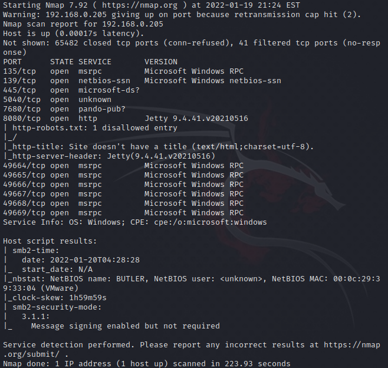

Looking at the results, if we do a quick google of some of the nmap results, we will find that Jetty 9.4.41 does not appear to have any obvious vulnerabilities, as it is the patched version for most that you'll find.  Looking at port ```8080``` in a browser shows that it is running Jenkins with a login page.  Additionally port ```7680``` is not confirmed to be running pando-pub, a bit torrent application, but if it were, there's no easily located exploits.  It's also more likely the Windows 10 update optimization service which also runs on ```7680``` to provide updates to other computers on your network.  That at least gives us a hint as to what OS version we're running, however, not which revision.

If we browse to ```/oops``` we're able to see what version of Jenkins is currently running.

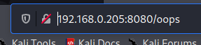

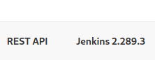

Looking around for exploits for Jenkins 2.289.3, there does not seem to be any exploits that don't at least require you to be authenticated first.  So, that's out for now.

Digging around we can also find that the system responds as being vulnerable to SMBGhost, however, exploits cannot successfully execute against it.

With nothing left to try, it looks like we'll have to brute force the login to Jenkins so that we can get access to the authenticated exploits.

We're going to open up Burp Suite, enable Interception, and open the browser.  From there, enter a test username and password.

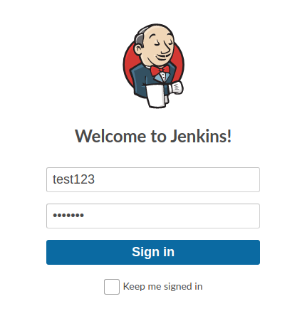

Burp Suite will then pick up the traffic.

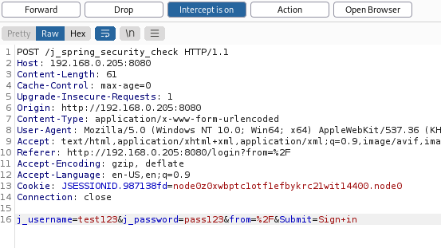

Right click on the traffic and choose "Send to Intruder"

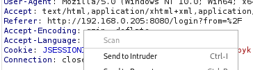

Now go to Intruder and to the Positions tab.  Hit the Clear button, and then use the Add button to select the username and password.

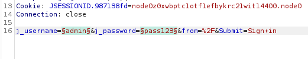

Set your attack type to Cluster Bomb.

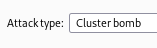

Now go to Payloads.

Set Payload set 1 to Simple list.

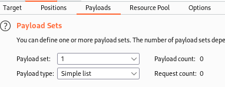

Now, since we don't know the user accounts for this, we're just going to have to guess a few (or we could use a list if we had one handy).

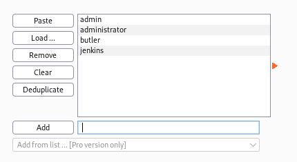

Next, set Payload set 2 to runtime file, then browse to and select the ```rockyou.txt``` wordlist.

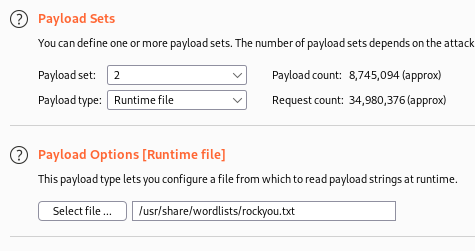

Next click start attack.

Once that starts running, select one of the attempts and go to response.

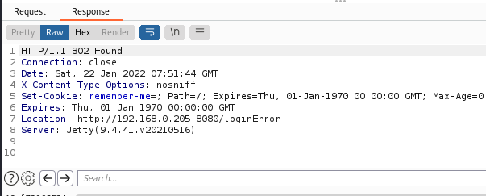

We see that the location of a failed login uses an URL ending in ```loginError```.  With that knowledge, we can filter on it so that we can more easily see when something is successful, as the errors will be marked as such.

Close the attack, then go to options in BurpSuite, browse down to "Grep - Match" and add ```loginError``` to the list.  After that, uncheck Exclude HTTP headers.

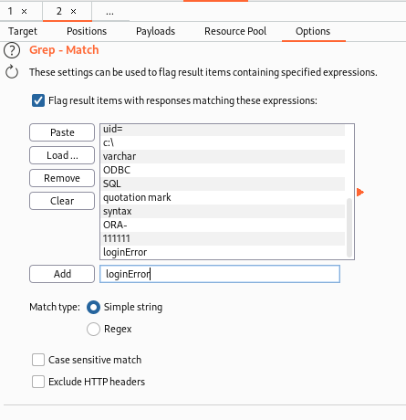

Now that we have that configured, click Start attack again.  This is going to take a while based on the size of the wordlist and that it's trying multiple user accounts.  So, grab a coffee, take a nap, play a video game, etc., and check back periodically to see if you have any attempts that aren't an error.

Sorting by error, successful logins are shifted to the top of the window.

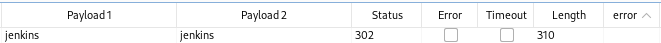

Looks like we've got credentials that we can now use to login to Jenkins.

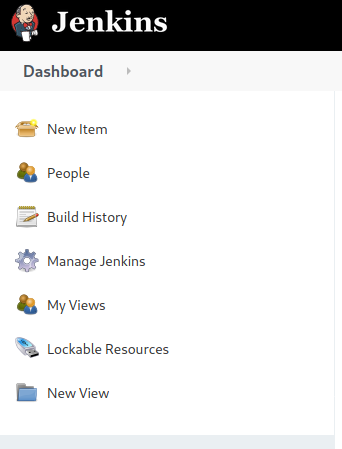

If we add ```/script``` to the end of the URL, we should get the Groovy script console.

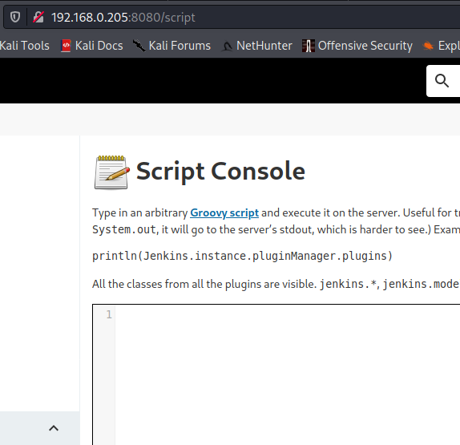

From here we can run ```powershell``` commands.  So we'll setup a ```netcat``` listener and attempt to create a remote shell via the script console.

The syntax follows:

>```
>def process = "powershell.exe <WHATEVER>".execute()
>```

In this case we're going to use the base64 encoded reverse shell that we've used on prior machines.

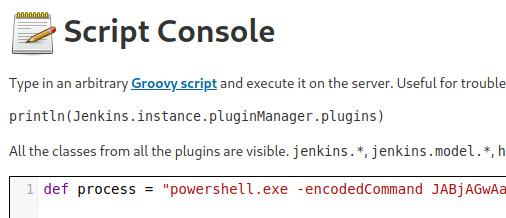

Let's check our listener to verify it worked.

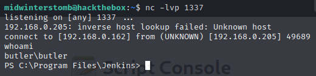

Let's store a copy of psexec and a batch file that contains our powershell reverse shell in a directory to share.

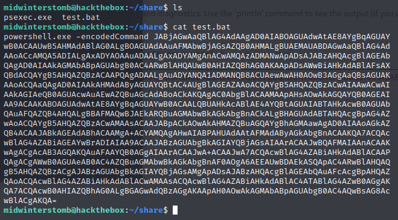

Now let's start a ```python``` web server so we can download these files remotely.

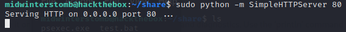

Now let's remotely download these files to the box.

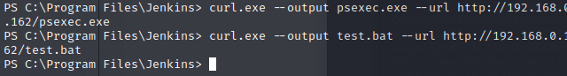

Now that we have both files, let's start another listener, and then use ```psexec``` to launch the batch file as system.

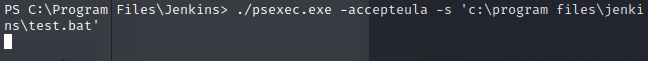

Now to check our listener.

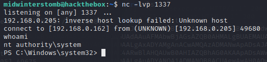

And with that, another box is finished.