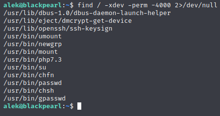

# Blackpearl


Go go Gadget ```nmap```!


We've got SSH and DNS, and we see port ```80``` running a web server, so let's take a look at what's there.


Looks like like it's just a default welcome page for nginx.  Time to dirbust!  While that runs, let's also view the page source to see if there's anything useful.


Looks like we have no results, no dice there.  However, if we add a host record for blackpearl.tcm (as the web master address listed used @blackpearl.tcm for the domain), we're able to access some web server information as it seems the virtual host is expecting that domain name.


If we now use http://blackpearl.tcm/ for dirbuster we find that there is a subdirectory called ```navigation```.  If we browse to it, it looks like it's some sort of content management system.


If we look around online, we find that there's an SQL injection bypass for the login that is passed via a cookie.  So let's use a cookie editor to add a new cookie.


Now that we have the cookie in place, let's refresh the webpage.


And we're in.

Since we now know that we can do SQL injection via the cookie, let's see if we can glean any information from causing an error.

First log out, delete the cookies, and then we'll recreate it.


Now refresh the page again.


Okay, let's see if we can gain any info from this error page.

If we look in Constants, we find a username and password.


Let's see if we can use these credentials to SSH into the box.


Looks like that works.  While we're here, let's check Alek's SETUID permissions.



So we'll keep that bit of knowledge handy in case we need it for later.  In the mean time, it looks like there's a further exploit that allows you to upload a file and overwrite ```php_info.php``` via improper handling of directory traversal.

Any by later, I mean that we have two paths forward from this point.  We can use the exploit to gain access to ```www-data``` and then gain root, or we can use the SSH login for Alek to do the same.  We'll start with getting access to ```www-data```.

Let's look at our cookies to see what our session ID is.


Now that we have our session ID to use for the file upload, let's open terminal and whip together an upload using ```cURL```.

Since the file upload has to process as an image, let's rename our ```webshell.php``` file to a .jpg before attempting to send it.


Now, let's browse to ```php_info.php``` to see if our webshell uploaded properly.


Looks good, now let's verify the account we have access to.


Let's see what all ```www-data``` has SETUID permissions to run.


We see that ```php7.3``` is there, which can potentially be exploited to run commands.  First, let's create a reverse shell to make this a little easier.


Let's create an environment variable called ```CMD``` and set it to the path for shell.


Now let's change the process UID and call our variable to get a root shell.


Excellent, now we're root.

Remember how I said we could also do this as Alek?


Now we're root with a bash shell.


And with that, we're done another box.