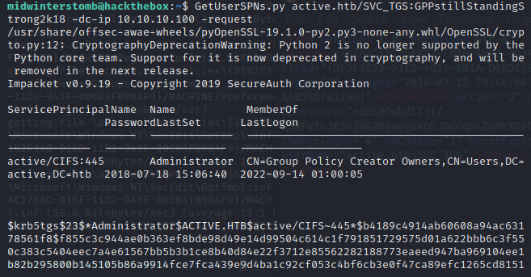

# Active


Here I go again on my own!  Gonna ```nmap``` this from my office in my home!


Okay, looking at the resutls, let's enumerate SMB.


The ```Replication``` share has anonymous access.  Let's access it with ```smbclient```.


Let's turn off prompting and enable recursive listing.


With that done, let's list files in the directory.


Now we'll download all the files with ```mget *```.


If we search the files downloaded, we can find ```Groups.xml```, which may contain GPP (Group Policy Preferences).


Looking at the file contents, it contains the domain Ticket Granting Service account (```active.htb\SVC_TGS```) and the ```cPassword```.


We can now use ```gpp-decrypt``` to decrypt the ```cPassword```.


Now to verify the credentials are working when passed with ```crackmapexec```.


That looks good, now let's get SPNs with ```GetUserSPNs.py```



We'll now copy the entire hash into ```hashcat``` and crack the hash.


Let's now use ```psexec.py``` to spawn a shell using our newly acquired credentials.


With our shell, let's collect the flags.


And we're done!

___

Findings

___

**Operating System:** Windows Server 2008 R2 Standard

**IP Address:** 10.10.10.100

**Open Ports:**
- 53
- 88
- 135
- 139
- 389
- 445
- 464
- 593
- 636
- 3268
- 3269
- 5722
- 9389
- 49152
- 49153
- 49154
- 49155
- 49157
- 49158
- 49165
- 49166
- 49168

**Services Responding:**
- DNS
- Kerberos
- RPC
- LDAP
- SMB
- MC-NMF

**Vulnerabilities Exploited:**
- SMB share allows anonymous login
- Groups.xml storing Group Policy Preferences
- Administrator account using known breached password

**Configuration Insecurities:**
- SMB share allowing anonymous login
- Group Policy Preferences stored in Groups.xml
- Administrator account using known breached password

**General Findings:**
- Consider placing all SMB shares behind authentication
- Consider removing Group Policy Preferences from Groups.xml
- Consider strengthening authentication scheme for Administrator account

___

[Back](../)
