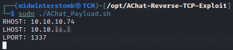
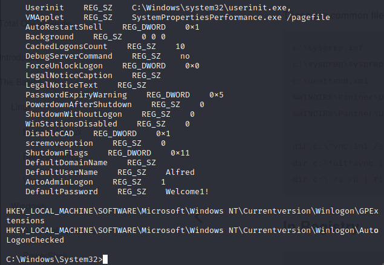

# Chatterbox


I clap, you clap, we all clap for ```nmap```.


Looking at the results we have something we haven't seen before.  So let's search for AChat exploits.  (In this case, we're using [https://github.com/mpgn/AChat-Reverse-TCP-Exploit](https://github.com/mpgn/AChat-Reverse-TCP-Exploit))

Let's ```git clone``` the repo to our ```/opt``` directory.


To avoid using metasploit, and use a ```netcat``` listener instead, we must edit the ```AChat_Payload.sh``` file before running it:


Now, let's generate the payload.




We'll now copy the payload into ```AChat_Exploit.py```, followed by editting the server address:


Next we'll get our ```netcat``` listener setup.


Lastly, we'll launch the exploit.


Let's check our listener.


Looks good, let's grab the user flag.


Let's check if there's an autologon account on this system with ```reg query "HKLM\SOFTWARE\Microsoft\Windows NT\Currentversion\Winlogon"```.



Looks like we have Alfred's password now, let's keep that in mind, in case we need it later.

Let's run ```netstat -ano``` to see what all is listening on the server.


We don't see anything too interesting that's only on the inside that we didn't already see on the outside.

Let's see if Alfred is a lazy admin and reusing the password for the administrator account.  We'll attempt to browse to the SMB share.


Looks like that is indeed the case.


Let's go grab that root flag and call it a day.


And with that, we're done another box.

___

Findings

___

**Operating System:** Windows Server 2008 R2 Standard

**IP Address:** 10.10.10.74

**Open Ports:**
- 135
- 139
- 445
- 9255
- 9256
- 49152
- 49153
- 49154
- 49155
- 49156
- 49157

**Services Responding:**
- RPC
- SMB
- AChat

**Vulnerabilities Exploited:**
- CVE-2015-1578
- CVE-2015-1577
- Password reuse

**Configuration Insecurities:**
- Weak authentication scheme
- Password reuse

**General Findings:**
- Consider replacing AChat due to CVE-2015-1578 and CVE-2015-1577 affecting software with no patch available
- Consider strengthening authentication scheme
- Consider changing Administrator password to a more secure, randomly generated password

___

[Back](../)
