# Access


Wonder where we're going to start?  Couldn't be ```nmap```, could it?

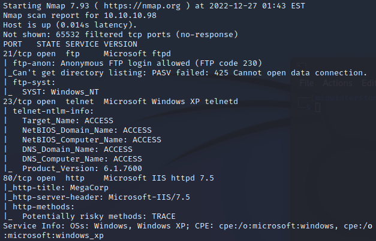

Looking at the results, we have FTP, telnet, and a web server responding.  If we look at port ```80```, it looks like it's just a picture of some server racks, with a name of possible location.

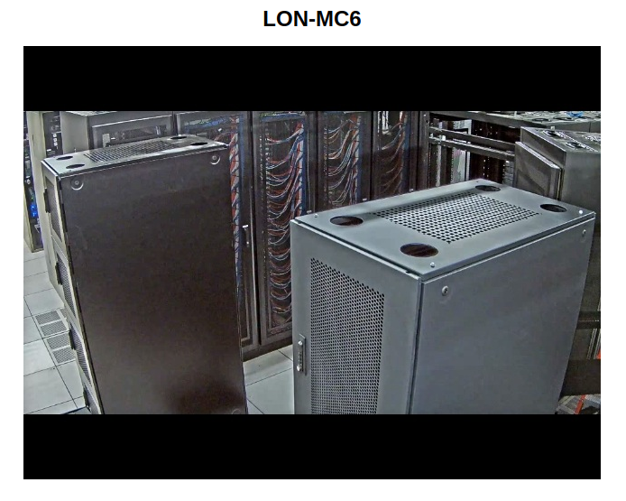

If we test FTP access, we are allowed anonymous access and find two folders.

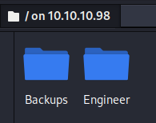

In the backups folder, we have a Microsoft Access database, that looks like access control information.  In the Engineer folder is a zip file called Access Control.

Looking inside the Access Control archive we see there is a .pst file, however, the zip file is password protected.

Looking in the Access database, we find some credentials.

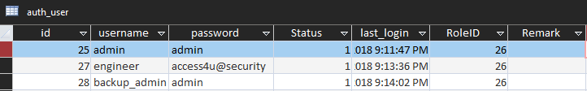

If we attempt those credentials against ```telnet```, we find that none of them have access, however, we find that engineer is a legitimate account, and the password is correct.  It just does not have access to ```telnet```.

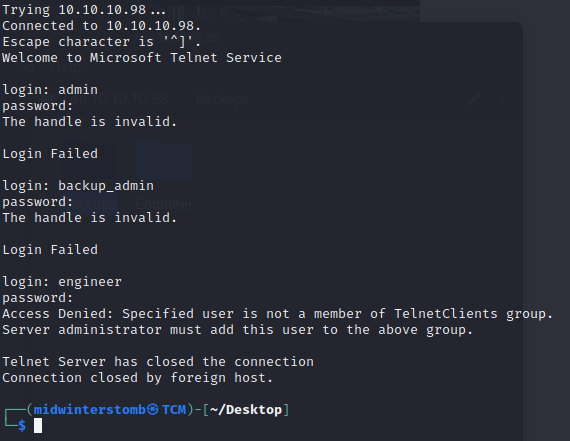

It turns out that engineer's password is also the password for the zip file (shock of shocks being that it came from the Engineer folder).  Let's take a look at the .pst file to see if there's any gold there.

Looking in the .pst file we see there's a single e-mail that contains credentials.

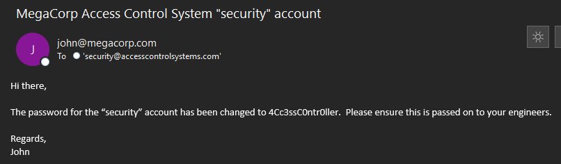

Using those credentials for ```telnet```, we then get access to a shell.

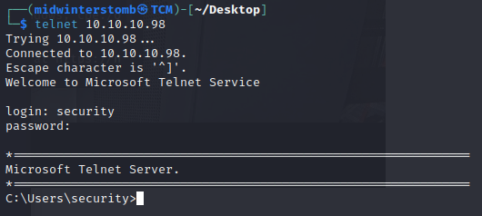

Let's grab the user flag while we're here.

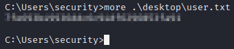

If we run ```cmdkey /list``` we see that the Administrator account is cached.

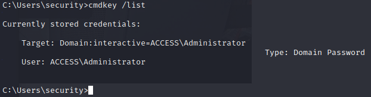

If we do ```systeminfo```, we see that the system is running Server 2008 R2 Standard.

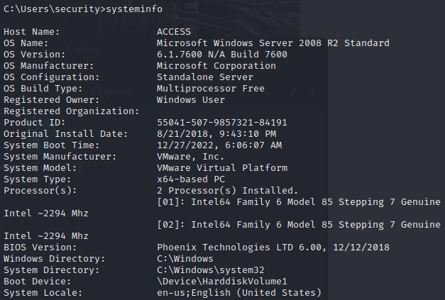

Let's download ```netcat``` to the computer, and then use those creds for a reverse shell.

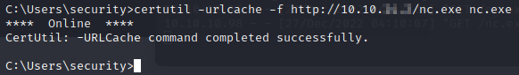

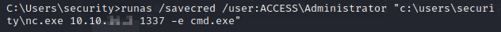

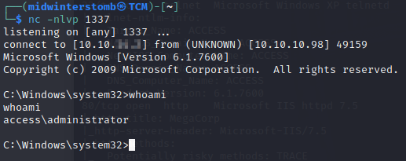

Now that we're the Administrator, let's go grab the flag.

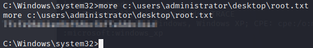

See you in the next box.

___

[Back](../)
