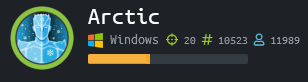

# Arctic



Pssst... Hey... You got any of that ```nmap```?


Port ```8500``` in the results thinks it's ftmp based on port number, however, it's not confirmed.  Let's try opening it in a web browser.


Based on the CF in each folder, it looks like it's probably a ColdFusion server.

If we go into ```CFIDE``` and then ```Administrator```, we can confirm this.


It is an Adobe ColdFusion 8 server.

If we run ```searchsploit``` for ColdFusion, we see that there's a remote code execution python script for ColdFusion 8.


Let's copy that python script over to our current directory.


Let's edit the python script to specify our IP, the server's IP, and the appropriate ports.


Now, let's run the script.


Let's grab the user flag before we move on to escalation.


Let's run ```systeminfo``` to see what we can learn about this box.


Let's copy the contents of ```systeminfo``` to a text file and use Windows Exploit Suggester.


We see that there's a kernel exploit that can potentially elevate privileges.


We've seen this before.  Let's browse out to https://github.com/SecWiki/windows-kernel-exploits/tree/master/MS10-059, download the executable, and copy it over to our victim.


Now let's grab the root flag.


See you in the next box.

___

[Back](../)
