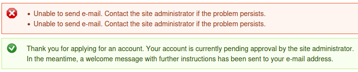
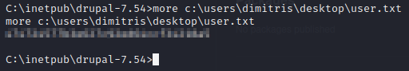

# Bastard


If we attempt to ```nmap``` the box non-stealthily, ```nmap``` drags and doesn't respond in any reasonable time.


However, if we stealth scan, we get results.


If we open port ```80``` in a web browser, we get a login page for a Drupal site.


We have the option to create a new account, let's see if what we can do with that.


If we create an account, it says that it needs to be approved by an administrator, as well as that it will send an e-mail, which clearly fails.



If we examine the results from ```Wappalyzer```, we see that it's running Drupal 7.


If we look around for CVE's for Drupal 7, we find CVE-2018-7600, including this github: https://github.com/pimps/CVE-2018-7600

Let's clone this repo, start up a webserver hosting ```netcat```, as well as a ```netcat``` listener, and then launch this exploit.


Okay, let's see if we have read rights to the user flag.



With that out of the way, let's run ```systeminfo``` to find out more about the system.


If we run Windows Exploit Suggester, it looks like the system is vulernable to MS10-059, which we're familiar with.


Additionally, if we do a ```whoami /priv``` on the box, we see that we have the ```SEImpersonate``` permission.


So, let's try Chimichurri first, and if that doesn't work out, then we'll try a potato attack.

Let's copy over ```MS10-059.exe``` and start up a listener.


Looks like we're good.  Now let's go grab the root flag.


See you in the next box.