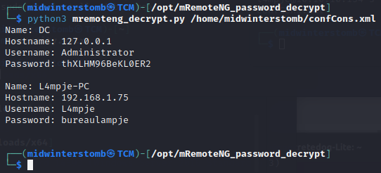

# Bastion


Home, home cyber range

Where geeks and enthusiasts play

Where seldom is heard a discouraging word

And ```nmap``` results are read-ay


If we look at SMB, we see that there's a share available called ```Backups```.


Let's attempt to connect to it with the guest account.


Inside is a file called ```note.txt```, so let's snag that real fast.


If we look at the contents, it's a note to sysadmins for backups.  We'll store that for later, in case we need it.


Let's now take a look through the folder ```WindowsImageBackup``` to see if we can find anything useful.


Let's mount the the SMB share.


Now let's mount the larger of the two VHD files, as the smaller is the boot partition.


Let's see if we can now browse the .vhd file.


If we browse to ```Windows/System32/Config``` we can copy the ```SAM```, ```SYSTEM```, and ```SECURITY``` files.

From there we can dump the user hash using ```secretsdump.py```.


Now that we have L4mpje's password, let's attempt to login to SSH with it.


Let's grab the user flag real fast.


Now let's see what we can do to escalate our privileges.

First, let's run ```systeminfo``` to see what we have going on.


It would appear that L4mpje has some restricted rights.

Let's run a ```whoami /priv``` to see what's going on there.


Well, not much to work with.  Let's upload a copy of winPEAS and see if we can run that.


Looks like ```certutil``` is blocked as well.  So we'll have to get the file another way.


Trying to run winPEAS will hang the session, so we'll have to keep an eye on the ```maybe.txt``` file to see if it grows in size.


Looks to be working.  However, we have no way of know when exactly it will be done.  So we'll possibly have to grab a few copies of the file.


It worked, but it's a little hard to read at first.  If you know that the color red is written as ```1;31m```, then you can search for that to find any items that would normally be red in winPEAS.

The results of winPEAS weren't particularly useful, so let's manually browse through directories.

If we go to ```Program Files (x86)``` we see an application called ```mRemoteNG```.


If we look at the ```Readme.txt``` file in ```mRemoteNG```, it says that it's used for storing remote login credentials.


Let's dig through this directory and see if we can figure out where mRemoteNG stores the credentials.

If we look online we find that credentials are stored in ```%APPDATA%\mRemoteNG\confCons.xml```.


If we look at ```confCons.xml``` we see the Administrator account stored for RDP with the password encoded as base64.


However, if we attempt to decode the base64, we get unicode characters back.  Looking online, it seems that there is a tool specifically for decrypting mRemoteNG passwods.  (https://github.com/gquere/mRemoteNG_password_decrypt)

Let's clone that repo and copy the ```confCons.xml``` file to our local machine.

First, let's toss it in an easier spot to grab with SCP.


Then copy it over.




Now that we have the Administrator password, let's log back in via SSH and go get the flag.


See you in the next box.