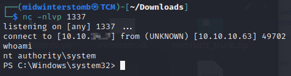
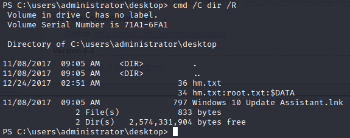

# Jeeves


[```nmap``` is not the territory.](https://www.youtube.com/watch?v=0e-B3wX2CUk)


Looks like we've got SMB and HTTP responding.

Looking at port ```80```, I'm having flashbacks.  It's not Alta Vista, but I'll take it.


Let's run a test search to see if anything interesting happens.


Interestingly, this is just an image on a static HTML page.  Looking at the code of the search page, it looks like when you click search it just directs to ```error.html```.

If we check port ```50000``` we get a 404 error.


If we run dirbuster against port ```50000```, we see there is a directory called ```askjeeves``` that we can look at.


Since we've seen Jenkins before ([on the machine Butler](../2022-01-23-Butler/)), we know that if we look under manage settings, we have an option for running groovy scripts.


We've also learned in the past that we can use groovy to execute commands, including calling a ```powershell``` reverse shell.  Remember, the format is:

>```powershell
>def process = "powershell.exe %stuffgoeshere%".execute()
>```

Let's setup a listener and connect.


Let's grab the user flag before we move on.


Let's check what privileges we have with our current account.


Being that we have the ```SeImpersonatePrivilege```, we can run a potato attack against this box.  So, let's download ```juicypotato.exe``` to the victim machine.


I've created an .exe in C++ to perform a ```powershell``` reverse shell.  Nothing fancy, but easy to call as a single executable rather than specifying command switches.  Here is the uncompiled file:


Now we'll setup a listener on the corresponding port.

We'll copy the ```rev.exe``` file to the victim server.


With those files in place, let's launch ```juicypotato.exe```.




Now that we're the system account, let's grab the root flag.


Huh, no results, let's see if it's actually in that folder.


After doing some poking around the system, we see that there's a KeePass database in Kohsuke's documents.


We could setup an SMB share and mount it to move the file, use ```netcat``` to move it, or any number of things, but let's convert it to a base64 string that we can copy and paste to our attack box and convert back to a file.


(To reverse it back to a file, on your attack box, use:

>```echo '%base64texthere%' | base64 --decode > CEH.kdbx)```

Now we'll use ```keepass2john``` to extract the password hash.


Looking at the "It's a secret" entry, it looks like it is for something running on the localhost, however if we check ```netstat```, the port isn't up right now.

Additionally the "Backup Stuff" entry looks to have a password hash, though no user account.


However, since we're already running as the system account, we have all the privileges we need.  Let's dig even further.

If we run dir /R around different folders, we find that the hm.txt file from earlier has an alternate data stream.



Let's take a look at the contents of that alternate data stream.


Another one down.  See you in the next box.

___

Findings

___

**Operating System:** Windows 10

**IP Address:** 10.10.10.63

**Open Ports:**
- 80
- 135
- 445
- 50000

**Services Responding:**
- HTTP
- RPC
- SMB

**Vulnerabilities Exploited:**
- Web application requiring no authentication to access admin console
- SeImpersonatePrivilege exploit

**Configuration Insecurities:**
- Web application with anonymous access to access admin console
- Limited user has SeImpersonatePrivilege set

**General Findings:**
- Consider placing web application behind authentication
- Consider removing SeImpersonatePrivilege from user account

___

[Back](../)
