# Granny


By now you know where this is going, of course it's ```nmap```.

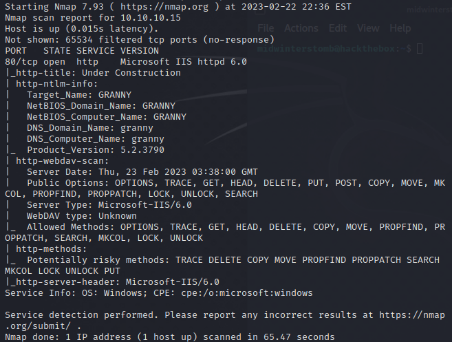

If we look at the results, it seems that this is basically [Grandpa](../2021-06-15-Grandpa/).

We already have the IIS6 exploit for CVE-2017-7269 downloaded, but if we didn't have it, we could get it here: https://github.com/g0rx/iis6-exploit-2017-CVE-2017-7269

We'll setup a listener and kick off the exploit.

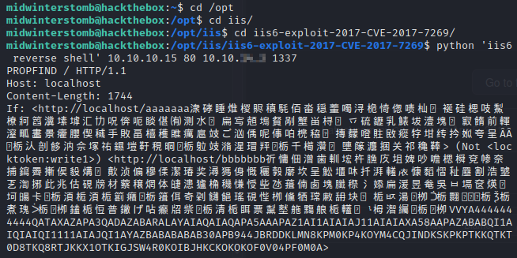

Let's check our listener to make sure it went through.

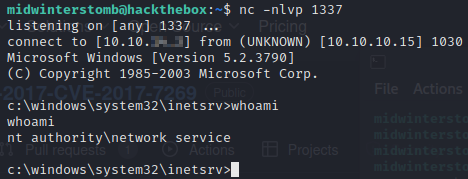

Let's run ```systeminfo``` to get some details.

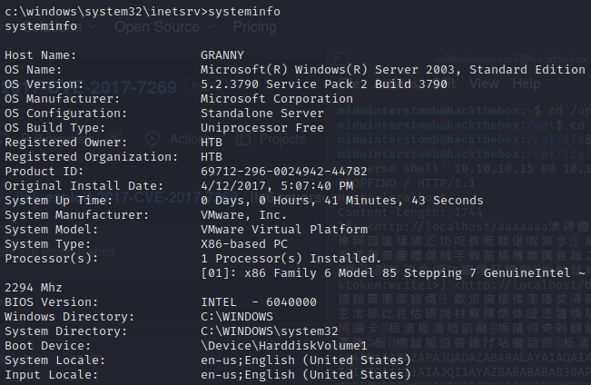

And now ```whoami /priv``` to check our privileges.

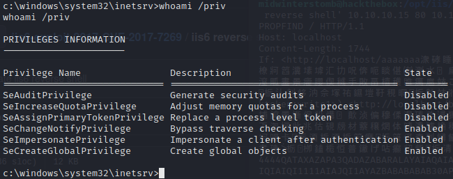

Since we have the ```SeImpersonatePrivilege``` privilege, we'll go the Churrasco route again.

We'll make a temp folder to run it from.

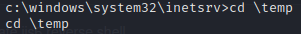

Now, if we didn't already have Churrasco, we could download it from https://github.com/Re4son/Churrasco/raw/master/churrasco.exe.

Now we'll share ```churrasco.exe``` and ```nc.exe``` via SMB.

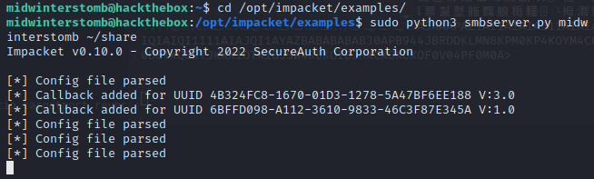

Now we'll mount the share and copy both to the temp folder.

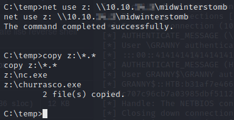

We'll now create batch file to create the reverse shell.

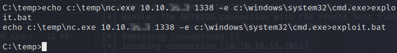

Next we'll start a listener and then run ```churrasco.exe``` with our batch file.

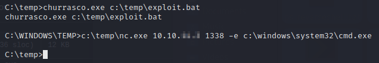

Let's check our listener.

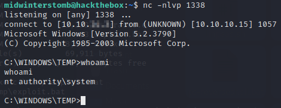

Now that we're root, let's grab the flags.

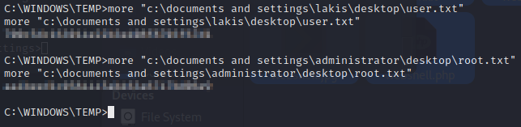

See you in the next box.
