# Mantis


Pssst.  Hey.  You got any of that ```nmap```?

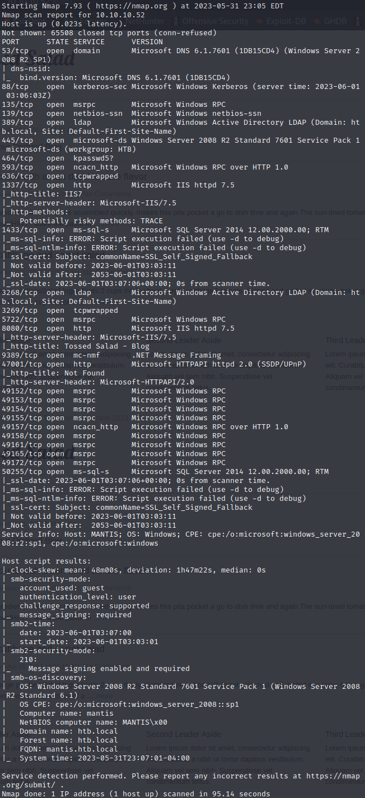

We've got choices here, but let's start with the web servers.

First, let's check port ```1337```.


Looks like a default ```IIS``` page.  Let's go check port ```8080```.


Seems we have a blog site without much in it running Orchard CMS.

We'll kick off ```DirBuster``` for both web server ports.

We have some promosing results on port ```1337```.

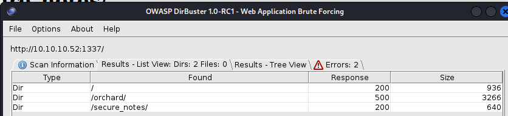

Let's take a look at that ```secure_notes``` directory.

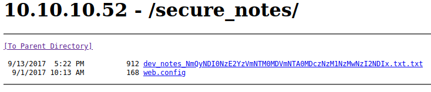

Let's check out that text file to see what's inside.

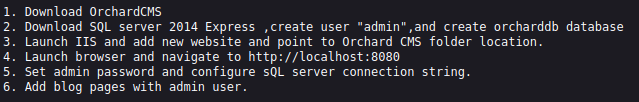

Clues point to the ```SQL``` port we saw open earlier as a possible means of attack and a potential username of "admin" and a database  name of "orcharddb".

Looking at that file name however, it looks like it's base64 string in the filename.  Let's convert it.

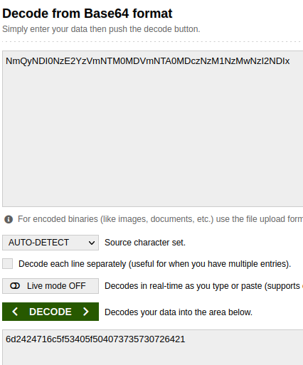

Okay, we got some hex back, let's convert that to ASCII.

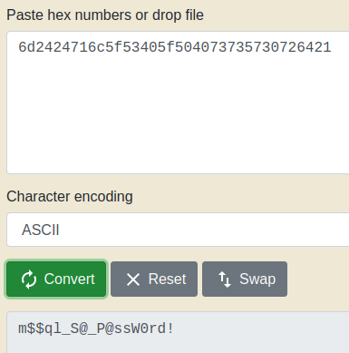

Let's try connecting using ```mssqlclient.py```

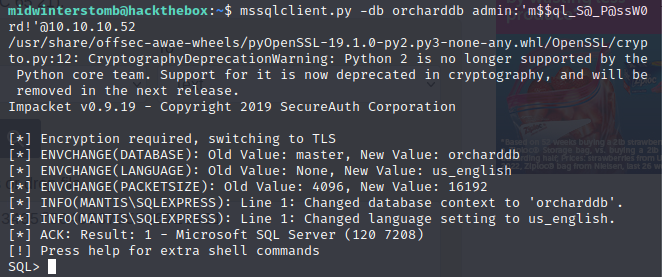

Looks good, let's see if we can execute commands with ```xp_cmdshell```.

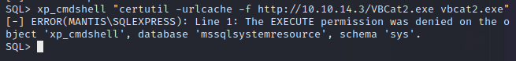

Nope, looks like ```xp_cmdshell``` isn't currently enabled.

Let's start up ```responder``` and then try to capture a hash using ```xp_dirtree```.

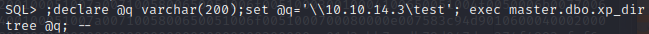

Looks like we got a hash back for the system account.

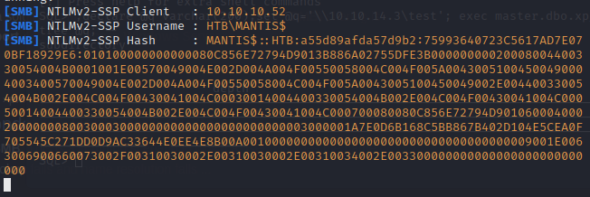

Let's search for all tables in the database to see what's here.

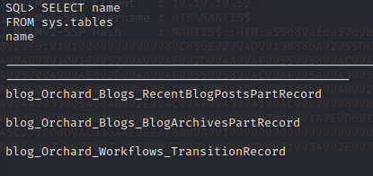

Looking through the list, table ```blog_Orchard_Users_UserPartRecord``` looks promising.  Let's look at the contents.

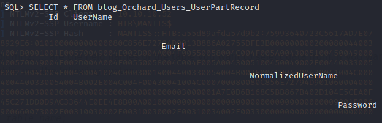

Looks like the table contains usernames, and passwords among others.

If we scroll down, we've got James' password for, most likely, Orchard CMS.

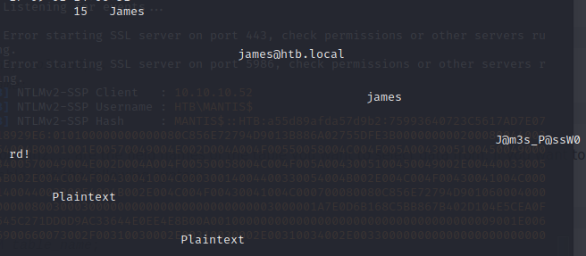

Let's try logging in to the blog with his credentials.

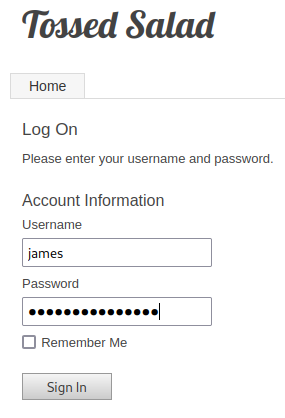

Well, that didn't work.

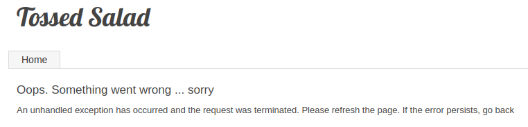

Since that's the case, let's test his credentials against ```SMB``` to make sure the credentials aren't a red herring.

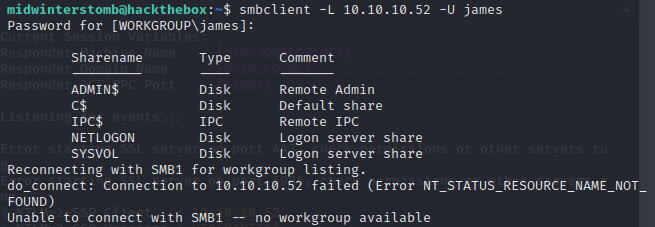

That's promosing, however, no shares are writable, so can't use them to get a shell.

Looking back at our ```nmap``` results, let's look up ```Server 2008 R2 SP1 7601 kerberos exploits```.

We find that it is vulnerable to ```MS14-068```, which if we Google the approriate CVE (```CVE-2014-6324```), we find Impacket's ```goldenPac.py``` exploit.

Let's give that a run against the machine and see if we're successful.

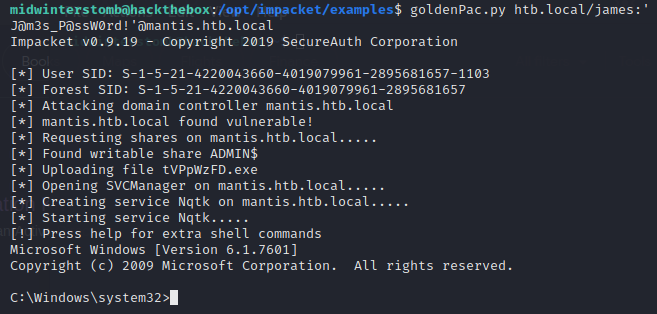

Looking good, let's check to make sure we're ```nt authority\system```.

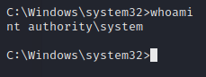

Indeed, that is the case.  Let's grab the user and root flags.

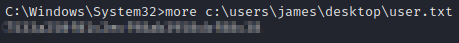

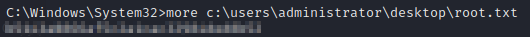

And we're done.  Catch you in the next box.

___

**Operating System:** Windows Server 2008 R2 Standard Service Pack 1

**IP Address:** 10.10.10.52

**Open Ports:**
- 53
- 88
- 135
- 139
- 389
- 445
- 464
- 593
- 636
- 1337
- 1433
- 3268
- 3269
- 5722
- 8080
- 9389
- 47001
- 49152
- 49153
- 49154
- 49155
- 49157
- 49158
- 49161
- 49161
- 49165
- 49172
- 50255

**Services Responding:**
- DNS
- Kerberos
- LDAP
- SMB
- LDAPS
- HTTP
- MS-SQL
- RPC

**Vulnerabilities Exploited:**
- Passwords stored insecurely
- CVE-2014-6324

**Configuration Insecurities:**
- Passwords stored insecurely with 

**General Findings:**
- Consider storing passwords in a secure fashion
- Consider if admin account needs xp_dirtree permissions
- Consider replacing Windows Server 2008 R2 Standard Service Pack 1 due to end of support
  - If not able to be replaced, consider installing all missing patches to limit attack surface
  - If not able to be replaced or patched, consider restricting ports further

___

[Back](../)